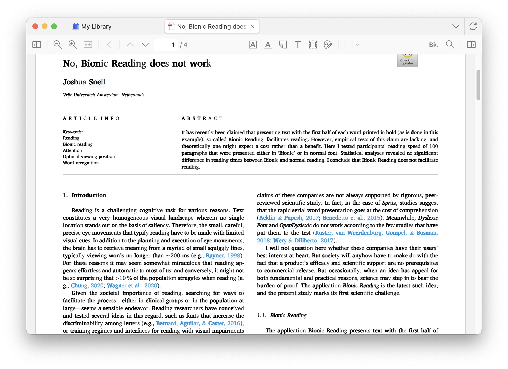

# Bionic for Zotero Reader

[](https://www.zotero.org)
[](https://github.com/windingwind/zotero-plugin-template)

**Bio**nic **read**ing **exper**ience **wi**th **Zot**ero.

<div align=center></img></div>

## 🧩 Outline

[🧐 What is this?](#-what-is-this)

[👋 Install](#-install)

[😎 Quick start](#-quick-start)

[🔧 Development](#-development)

[🔔 Disclaimer](#-disclaimer)

[🔎 My Zotero Plugins](#-my-zotero-plugins)

[🤗 Contributors](#-contributors)

## 🧐 What is this?

Bionic for Zotero is a Zotero plugin that implements a bionic reading experience in the Zotero reader.

### What is bionic reading?

Bionic Reading is a reading method designed to make it easier and faster to comprehend text by guiding the reader's eyes through bolded initial letters of words. This technique emphasizes the beginning of each word, allowing the brain to "fill in" the rest of the word and phrase intuitively, leveraging cognitive shortcuts.

**A**s **sho**wn **i**n **th**is **sent**ence, **t**he **bol**ded **init**ial **lett**ers **o**f **ea**ch **wo**rd **a**re **us**ed **t**o **gui**de **t**he **read**er's **ey**es **thro**ugh **t**he **te**xt, **mak**ing **i**t **eas**ier **t**o **compr**ehend.

### Why bionic reading works/doesn't work?

The effectiveness of Bionic Reading is a subject of ongoing debate, largely because it depends on individual differences in reading habits, cognitive processing, and preferences.

Want to know more? Check out the latest research on [Google Scholar](https://scholar.google.com/scholar?q=bionic%20reading).

## 👋 Install

- Download the plugin (.xpi file) from below.

  - [Latest Stable](https://github.com/windingwind/bionic-for-zotero/releases/latest)
  - [All Releases](https://github.com/windingwind/bionic-for-zotero/releases)

  _Note_: If you're using Firefox as your browser, right-click the `.xpi` and select "Save As.."

- In Zotero click `Tools` in the top menu bar and then click `Plugins`
- Go to the Extensions page and then click the gear icon in the top right.
- Select `Install Add-on from file`.
- Browse to where you downloaded the `.xpi` file and select it.
- Finish!

## 😎 Quick start

1. Open a PDF in the Zotero reader.
2. The PDF will be displayed in bionic reading mode by default.
3. To toggle bionic reading mode, use the `View` menu in the top menu bar.

## 🔧 Development

This plugin is built based on the [Zotero Plugin Template](https://github.com/windingwind/zotero-plugin-template). See the setup and debug details there.

To start, run

```bash
git clone https://github.com/windingwind/bionic-for-zotero.git
cd bionic-for-zotero
npm install
npm run build
```

The plugin is built to `./builds/*.xpi`.

## 🔔 Disclaimer

Use this code under AGPL. No warranties are provided. Keep the laws of your locality in mind!

## 🔎 My Zotero Plugins

- [Better Notes for Zotero](https://github.com/windingwind/zotero-better-notes): Everything about note management. All in Zotero.
- [Translate for Zotero](https://github.com/windingwind/zotero-pdf-translate/): Translate PDF, EPub, webpage, metadata, annotations, notes to the target language. Support 20+ translate services.
- [Actions & Tags for Zotero](https://github.com/windingwind/zotero-tag): Customize your Zotero workflow.

## 🤗 Contributors

<a href="https://github.com/windingwind/bionic-for-zotero/graphs/contributors">
  
</a>
